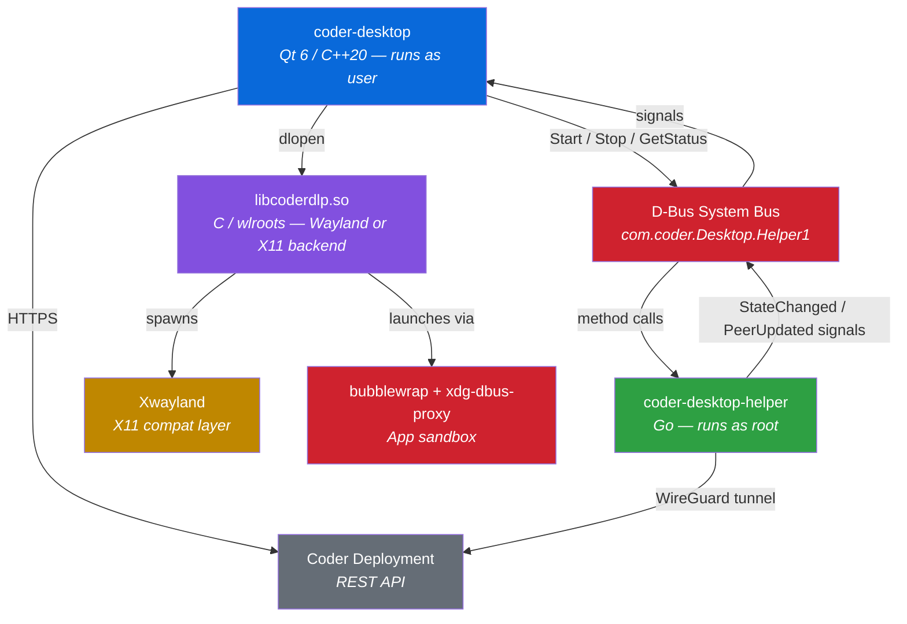

# Coder Desktop for Linux

[](https://github.com/coder/coder-desktop-linux/actions/workflows/ci.yml)
[](LICENSE)

A native Linux desktop application for managing [Coder](https://coder.com) remote development workspaces. Provides one-click VPN connectivity, a full workspace management UI, Coder Agents chat, and optional Data Loss Prevention (DLP) enforcement — all from your system tray.


## Features

- **VPN Connectivity** — Seamless Tailscale/WireGuard tunnels to your Coder workspaces with DNS-based routing. Connect, disconnect, and monitor status from the system tray.
- **Workspace Management** — Browse, start, stop, and monitor workspaces across one or more Coder deployments. View build logs and workspace agents in real time.
- **Coder Agents** — Chat with Coder AI agents from the desktop: streaming responses, plan mode, file attachments, diff viewer, sub-agent threads, and desktop notifications for completed or waiting agents.
- **Data Loss Prevention (DLP)** — Nested compositor sandbox that enforces clipboard, screenshot, and file-access policies on workspace applications. Works on both Wayland and X11 host desktops. Supports native Wayland apps and X11 apps (via Xwayland). Includes steganographic watermarking and D-Bus filtering. Managed via MDM or user settings.
- **File Sync** — Bidirectional file synchronization between local and workspace directories, powered by [Mutagen](https://mutagen.io/). Create persistent sync sessions that survive app restarts.
- **File Browser** — Graphical file explorer for workspace directories with breadcrumb navigation, upload, and download support. Transfers run over SCP through the VPN tunnel.
- **DLP-Aware File Transfers** — File sync and transfers respect Data Loss Prevention policies. Administrators can restrict uploads, downloads, or both via MDM settings.
- **Multi-Deployment Support** — Connect to multiple Coder deployments simultaneously with per-deployment credentials.
- **Three-Layer Settings** — User preferences, MDM policy overrides (`/etc/coder-desktop/policy.json`), and compiled defaults. Administrators can lock any setting via MDM.
- **Secure Credential Storage** — API tokens stored via `libsecret` (GNOME Keyring / KWallet) with encrypted-file fallback for headless environments.
- **Auto-Update Notifications** — Checks GitHub Releases for new versions on startup and notifies you when an update is available.

## Requirements

| Dependency | Version | Required | Notes |
|------------|---------|----------|-------|
| Linux | — | ✅ | x86_64 or aarch64 |
| Qt | ≥ 6.5 | ✅ | Core, Gui, Quick, QuickControls2, Network, Widgets |
| CMake | ≥ 3.21 | ✅ | Build system |
| Go | ≥ 1.25 | ✅ | For building `coder-desktop-helper` (VPN helper binary) |
| wlroots | ≥ 0.19 | DLP only | Wayland compositor for DLP sandbox |
| wayland | — | DLP only | Client/server libraries |
| libxkbcommon | — | DLP only | Keyboard handling in compositor |
| Mutagen | ≥ 0.18.1 | File Sync | Bidirectional file synchronization engine (auto-fetched with `-DFETCH_MUTAGEN=ON`) |
| libsecret | — | Recommended | Credential storage (GNOME Keyring / KWallet) |
| bubblewrap | — | DLP only | Sandbox launcher for file/network isolation |
| xdg-dbus-proxy | — | DLP only | D-Bus session bus filtering in sandbox |
| xcb, xcb-ewmh, xcb-icccm | — | DLP + X11 | Required for Xwayland support in DLP compositor |
| pkg-config | — | ✅ | Dependency resolution for C libraries |

> **Desktop compatibility:** DLP works on both Wayland and X11 host desktops. On Wayland hosts, the compositor runs as a nested Wayland client with full security enforcement. On X11 hosts, it runs inside a host X11 window using the wlroots X11 backend — clipboard and screenshot policies are enforced within the sandbox, though the host X11 session cannot provide the same isolation guarantees as Wayland (the UI indicates this with a yellow security badge vs. green on Wayland).

## Quick Install

Pre-built packages are available for common distributions. See the [`packaging/`](packaging/) directory for package sources.

### Debian / Ubuntu (.deb)

```bash
sudo dpkg -i coder-desktop_0.1.0_amd64.deb
sudo apt-get install -f  # resolve dependencies
```

### Fedora / RHEL (.rpm)

```bash
sudo dnf install coder-desktop-0.1.0-1.x86_64.rpm
```

### Flatpak

```bash
flatpak install coder-desktop.flatpak
```

### AppImage

```bash
chmod +x Coder_Desktop-0.1.0-x86_64.AppImage
./Coder_Desktop-0.1.0-x86_64.AppImage
```

## Build from Source

### Install dependencies

<details>
<summary>Debian / Ubuntu</summary>

```bash
sudo apt install build-essential cmake golang-go \
    qt6-base-dev qt6-declarative-dev qt6-webengine-dev \
    libwlroots-dev libwayland-dev libxkbcommon-dev \
    libxcb-ewmh-dev libxcb-icccm4-dev \
    libsecret-1-dev bubblewrap xdg-dbus-proxy pkg-config
```

</details>

<details>
<summary>Fedora</summary>

```bash
sudo dnf install cmake golang qt6-qtbase-devel qt6-qtdeclarative-devel \
    qt6-qtwebengine-devel wlroots-devel wayland-devel libxkbcommon-devel \
    xcb-util-wm-devel \
    libsecret-devel bubblewrap xdg-dbus-proxy pkg-config
```

</details>

### Build

```bash
# Configure
cmake -B build -DCMAKE_BUILD_TYPE=Debug

# Build all targets
cmake --build build -j$(nproc)

# Run
./build/app/coder-desktop
```

### Build individual targets

```bash
# Go VPN helper binary (built separately)
cd coder-vpn-linux && go build -o ../build/coder-desktop-helper ./cmd/coder-desktop-helper/

cmake --build build --target coderdlp         # DLP compositor library
cmake --build build --target coder-desktop    # Qt desktop application
```

## Architecture

Coder Desktop is a monorepo producing three build targets that compose at runtime. The Qt desktop application communicates with a privileged Go helper binary over the **D-Bus system bus** to manage the VPN tunnel — the helper runs as root and handles TUN device creation, DNS configuration, and routing.

For the full architecture reference, see [`docs/architecture.md`](docs/architecture.md). For file sync and file browser details, see [`docs/file-sync.md`](docs/file-sync.md).



| Component | Language | Source | Description |
|-----------|----------|--------|-------------|
| `coder-desktop` | C++20 / QML | [`app/`](app/) | Qt 6 desktop app — UI, tray, settings, credential storage |
| `coder-desktop-helper` | Go | [`coder-vpn-linux/`](coder-vpn-linux/) | Privileged D-Bus system service — VPN tunnel, TUN, DNS, routing |
| `libcoderdlp.so` | C | [`coder-dlp-compositor/`](coder-dlp-compositor/) | Nested Wayland compositor for DLP enforcement |

### D-Bus Interface

The helper exposes the `com.coder.Desktop.Helper1` interface on the system bus (see [`dbus/com.coder.Desktop.Helper1.xml`](dbus/com.coder.Desktop.Helper1.xml)):

| Type | Name | Description |
|------|------|-------------|
| Method | `Start(coder_url, api_token)` | Start the VPN tunnel to a Coder deployment |
| Method | `Stop()` | Stop the active VPN tunnel |
| Method | `GetStatus() → (state, coder_url)` | Query current VPN state (`disconnected`, `connecting`, `connected`, `disconnecting`) |
| Signal | `StateChanged(new_state, error_message)` | Emitted on VPN state transitions |
| Signal | `PeerUpdated(workspace, agent, hostname, status, last_ping_ms, is_p2p)` | Emitted when a workspace peer changes |
| Signal | `LogMessage(level, message)` | Forwarded log output from the helper |

[Polkit](packaging/polkit/com.coder.Desktop.Helper.policy) authorizes VPN management so the unprivileged Qt app can control the tunnel without a password prompt for active local sessions.

### Directory Structure

```
coder-desktop-linux/
├── CMakeLists.txt              # Top-level build (orchestrates all 3 targets)
├── app/                        # Qt 6 / C++ → coder-desktop
│   ├── src/                    # C++ sources
│   ├── qml/                    # QML UI files
│   └── tests/                  # Unit tests
├── coder-vpn-linux/            # Go → coder-desktop-helper binary
│   ├── cmd/coder-desktop-helper/  # Entry point
│   └── internal/
│       ├── dbusservice/        # D-Bus service implementation
│       ├── dns/                # DNS configuration (resolvconf/resolvectl)
│       └── sdutil/             # systemd notify wrapper
├── coder-dlp-compositor/       # C / wlroots → libcoderdlp.so
│   ├── include/coder_dlp.h     # Public C API
│   └── src/
│       ├── compositor.c        # Core compositor lifecycle
│       ├── xwayland.c          # Xwayland support for X11 apps
│       ├── watermark.c         # Steganographic watermarking
│       ├── sandbox_launcher.c  # bubblewrap + dbus-proxy launcher
│       ├── input.c             # Keyboard/mouse/touch handling
│       ├── output.c            # Display output management
│       ├── shell.c             # XDG shell protocol
│       ├── clipboard.c         # Clipboard mediation
│       └── security_context.c  # Wayland security context
├── dbus/                       # D-Bus interface XML, bus config, service files
├── packaging/                  # deb, rpm, flatpak, AppImage, polkit, systemd
├── docs/                       # Architecture and design documents
└── .github/workflows/          # CI pipelines
```

## Configuration

### Settings Layers

Settings resolve through three layers (highest priority first):

1. **MDM policy** — `/etc/coder-desktop/policy.json` (read-only, can lock individual settings)
2. **User preferences** — `~/.config/coder-desktop/settings.json`
3. **Compiled defaults**

When no MDM policy file is present, all settings are user-editable through the Settings UI. Administrators can deploy a policy file to enforce and lock specific settings across managed machines.

### Credential Storage

API tokens and session credentials are stored via the [Secret Service API](https://specifications.freedesktop.org/secret-service/latest/) (`libsecret`), which integrates with GNOME Keyring, KWallet, or any compatible secret store. An encrypted-file fallback is used in headless or keyring-less environments.

> **Security:** Credentials are never stored in plaintext settings files.

### Key Settings

| Setting | Default | Description |
|---------|---------|-------------|
| `deploymentUrl` | *(empty)* | Primary Coder deployment URL |
| `autoConnectVpn` | `false` | Connect VPN automatically on startup |
| `dlpEnabled` | `false` | Enable DLP compositor sandbox |
| `dlpClipboardBlock` | `false` | Block clipboard copy/paste in DLP mode |
| `dlpScreenshotBlock` | `false` | Block screenshots in DLP mode |
| `checkForUpdates` | `true` | Check GitHub Releases for new versions |
| `disableFileUpload` | `false` | Block local → remote file transfers |
| `disableFileDownload` | `false` | Block remote → local file transfers |
| `dlpFileSandbox` | `false` | Restrict file paths to sandbox-allowed locations |
| `notificationsEnabled` | `true` | Show desktop notifications |
| `theme` | `system` | UI theme (`system`, `light`, `dark`) |
| `dlpWatermarkEnabled` | `false` | Enable steganographic watermarking in DLP sandbox |
| `dlpDbusFilter` | `false` | Filter D-Bus session bus in DLP sandbox |
| `dlpDbusAllowedNames` | `[]` | D-Bus service names allowed through the filter (MDM-configurable) |

## Data Loss Prevention (DLP)

The DLP feature runs workspace applications inside a nested Wayland compositor (`libcoderdlp.so`, built on [wlroots](https://gitlab.freedesktop.org/wlroots/wlroots)). This compositor enforces:

- **Clipboard isolation** — Blocks copy/paste between workspace apps and the host desktop
- **Screenshot prevention** — Prevents screen capture of workspace content
- **File sandbox** — Restricts file system access via [bubblewrap](https://github.com/containers/bubblewrap)
- **Network sandbox** — Limits network access to approved endpoints
- **Xwayland support** — X11-only applications (JetBrains IDEs, legacy GTK2 apps) run inside the sandbox via Xwayland. Native Wayland apps connect directly to the compositor.
- **Steganographic watermarking** — Invisible per-frame watermarks encode a user identity fingerprint into rendered output for forensic tracing of screenshots
- **D-Bus filtering** — Session bus access inside the sandbox is filtered through `xdg-dbus-proxy`, restricting which D-Bus services sandboxed apps can talk to
- **X11 host support** — The compositor runs on X11 desktops (not just Wayland) using the wlroots X11 backend, with a security level indicator showing the protection tier

### Requirements

- **Wayland or X11 session** — DLP works on both Wayland and X11 host desktops
- **wlroots ≥ 0.19** — Build dependency for the compositor
- **bubblewrap** — Runtime dependency for file/network sandboxing
- **xdg-dbus-proxy** — Runtime dependency for D-Bus session bus filtering

### X11 Host Support

The DLP compositor supports both Wayland and X11 host desktops:

| Host Session | Backend | Security Level | Notes |
|-------------|---------|---------------|-------|
| **Wayland** | wlroots Wayland backend | 🟢 Full | Clipboard/screenshot isolation enforced by Wayland protocol |
| **X11** | wlroots X11 backend | 🟡 Reduced | Policies enforced within sandbox; host X11 cannot prevent external screen capture |

On X11 hosts, the compositor opens as a regular X11 window. Sandboxed applications inside it are still isolated from each other and from host clipboard/screenshots *within the compositor's scope*. However, the host X11 session does not provide per-client isolation, so a screen capture tool running on the host could still capture the compositor window. The Qt app displays a security level indicator (green for Wayland, yellow for X11) so users and administrators understand the protection tier.

> **When is DLP truly unavailable?** Only when neither Wayland nor X11 is available (e.g., headless/TTY-only environments). In this case, DLP UI elements are hidden and all other features work normally.

## Contributing

### Build & Run

```bash
cmake -B build -DCMAKE_BUILD_TYPE=Debug
cmake --build build -j$(nproc)
./build/app/coder-desktop
```

### Run Tests

```bash
# Qt app unit tests
cd build && ctest --test-dir app --output-on-failure

# Go tests
cd coder-vpn-linux && go test ./...

# All tests
cd build && ctest --output-on-failure
```

### Code Style

- **C++20** with Qt 6.5+ — follows the [C++ Core Guidelines](https://isocpp.github.io/CppCoreGuidelines/CppCoreGuidelines)
- RAII for all resource management; `std::unique_ptr` / `std::shared_ptr` for ownership
- `[[nodiscard]]` on factory functions and error codes
- Qt parent-child ownership for QObject-derived types
- `enum class` for all enumerations

### Project Guidelines

See [`AGENTS.md`](AGENTS.md) for detailed architecture notes, coding standards, and integration patterns.

## License

See [LICENSE](LICENSE).
