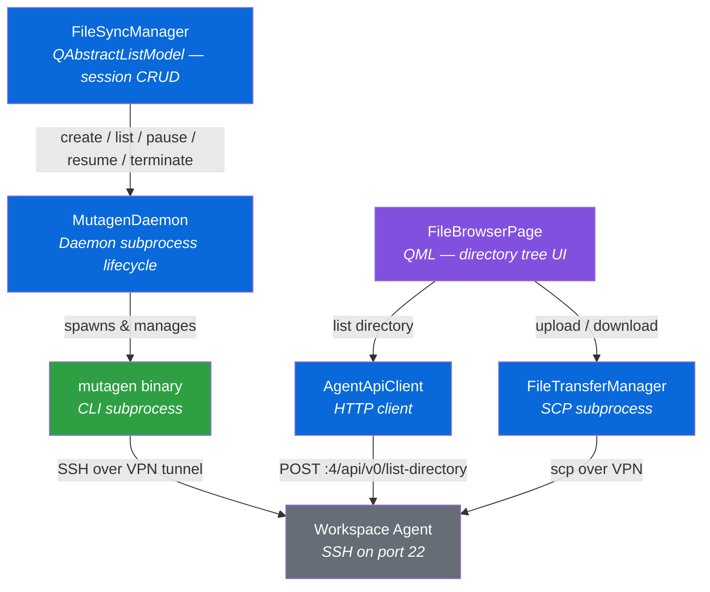

# File Sync & File Browser

## Overview

Coder Desktop for Linux provides bidirectional file synchronization and a
graphical file browser for workspace directories. These features let you keep
local directories in sync with remote workspace paths and transfer individual
files — all routed through the Coder VPN tunnel.

**File Sync** uses [Mutagen](https://mutagen.io/) to create persistent,
bidirectional sync sessions between a local directory and a directory inside a
running workspace. Sessions survive application restarts and are automatically
managed through the Mutagen daemon subprocess.

**File Browser** provides a tree-style directory explorer for any connected
workspace. You can navigate the remote filesystem, upload files from your local
machine, and download files to your local machine — transfers run over SCP
through the VPN tunnel.

Both features integrate with the DLP (Data Loss Prevention) policy system so
that administrators can restrict or disable file transfers on managed machines.

> **Comparison with macOS/Windows:** The macOS and Windows Coder Desktop clients
> use the Mutagen gRPC API via the embedded Coder SDK. The Linux client instead
> shells out to the `mutagen` CLI binary as a subprocess, keeping the integration
> simple and avoiding CGo/gRPC complexity. The end-user experience is equivalent.

---

## Architecture



### Component Inventory

| Component | Path | Purpose |
|-----------|------|---------|
| **MutagenDaemon** | `app/src/filesync/MutagenDaemon.h/.cpp` | Manages the `mutagen daemon` subprocess lifecycle (start, stop, orphan cleanup) |
| **FileSyncSession** | `app/src/filesync/FileSyncSession.h/.cpp` | Data model representing a single sync session's state (status, paths, errors) |
| **FileSyncManager** | `app/src/filesync/FileSyncManager.h/.cpp` | `QAbstractListModel` exposing sync sessions to QML; session CRUD via mutagen CLI; DLP policy enforcement |
| **FileTransferManager** | `app/src/filesync/FileTransferManager.h/.cpp` | Manages individual file upload/download operations via SCP subprocess |
| **AgentApiClient** | `app/src/api/AgentApiClient.h/.cpp` | HTTP client for the workspace agent's directory-listing API |
| **AgentDirectory DTO** | `app/src/api/dto/AgentDirectory.h` | `DirectoryEntry` and `DirectoryListing` data structures for API responses |

| QML Component | Path | Purpose |
|---------------|------|---------|
| **FileSyncPage** | `app/qml/FileSyncPage.qml` | Main File Sync tab — session list with create/edit/delete actions |
| **FileSyncSessionDialog** | `app/qml/FileSyncSessionDialog.qml` | Modal dialog for creating or editing a sync session |
| **RemoteDirectoryPicker** | `app/qml/RemoteDirectoryPicker.qml` | Tree-style directory browser used to select a remote sync path |
| **FileBrowserPage** | `app/qml/FileBrowserPage.qml` | File explorer with breadcrumb navigation, upload/download buttons |
| **TransferPanel** | `app/qml/TransferPanel.qml` | Collapsible panel showing active file transfer progress |

---

## Prerequisites

1. **VPN must be connected.** File sync and the file browser communicate with
   workspace agents over the VPN tunnel. The File Sync and File Browser tabs are
   disabled (or hidden) when the VPN is disconnected.

2. **Mutagen binary must be available.** The `MutagenDaemon` searches for the
   `mutagen` binary in three locations (in order):
   1. The directory containing the `coder-desktop` executable
   2. `../lib/coder-desktop/mutagen` (relative to the executable)
   3. `$PATH`

   To have CMake download Mutagen automatically during configure, pass
   `-DFETCH_MUTAGEN=ON`.

3. **Workspace agent must be running.** The target workspace must be started
   with a running agent (SSH on port 22, HTTP API on port 4).

---

## User Guide

### Creating a Sync Session

1. Connect the VPN from the system tray.
2. Open the **File Sync** tab.
3. Click **New Session**.
4. In the dialog:
   - **Local path** — choose a directory on your machine.
   - **Remote path** — use the **RemoteDirectoryPicker** to browse the workspace
     filesystem and select a target directory.
   - **Workspace** — select from the list of connected workspaces.
5. Click **Create**. The session starts synchronizing immediately.

Sessions persist across application restarts. The Mutagen daemon is
automatically started when the first session is created and stopped when the
last session is terminated.

### Managing Sync Sessions

From the **File Sync** tab you can:

- **Pause** — temporarily halt synchronization for a session.
- **Resume** — restart a paused session.
- **Edit** — change local or remote paths (session is recreated).
- **Delete** — permanently remove a session and stop synchronization.

Session status is polled every 2 seconds via `mutagen sync list --json` and
displayed in real time (watching, scanning, staging, reconciling, etc.).

### Browsing Remote Files

1. Connect the VPN.
2. Open the **File Browser** tab.
3. Select a workspace from the dropdown.
4. Navigate the directory tree using the breadcrumb bar or by clicking folders.

The file browser fetches directory listings from the workspace agent's HTTP API
(`POST /api/v0/list-directory` on port 4).

### Uploading and Downloading Files

- **Upload**: Click the upload button in the file browser toolbar, select a
  local file, and it is transferred to the current remote directory via SCP.
- **Download**: Select a remote file and click download. The file is copied to
  your chosen local path via SCP.

Transfer progress is shown in the **TransferPanel** at the bottom of the file
browser.

---

## DLP Policy Enforcement

File sync and file transfer respect the DLP settings from `SettingsManager`.
Policy is enforced at the UI layer (hiding controls) and at the sync engine
layer (restricting Mutagen sync direction).

### Enforcement Matrix

| `disableFileUpload` | `disableFileDownload` | File Sync Behavior | File Browser Behavior |
|:---:|:---:|---|---|
| ❌ | ❌ | Bidirectional sync (default) | Full upload + download |
| ✅ | ❌ | **Download-only** mode (Mutagen `--sync-mode=one-way-replica` remote→local) | Upload buttons hidden; download allowed |
| ❌ | ✅ | **Upload-only** mode (Mutagen `--sync-mode=one-way-replica` local→remote) | Download buttons hidden; upload allowed |
| ✅ | ✅ | **File Sync tab hidden entirely** | File browser is **read-only** (browse only, no transfers) |

Additional policy settings:

| Setting | Effect |
|---------|--------|
| `dlpFileSandbox` | Restricts allowed local paths to sandbox-approved locations |
| MDM-locked settings | Controls appear grayed out with a lock icon; users cannot override |

> **Important:** Policy checks happen in `FileSyncManager` and
> `FileTransferManager`, not in QML. UI code reads the policy state to
> show/hide controls, but the C++ layer enforces the restriction regardless.

---

## Configuration

### Build Flags

| Flag | Default | Description |
|------|---------|-------------|
| `FETCH_MUTAGEN` | `OFF` | Download the Mutagen binary during CMake configure |
| `MUTAGEN_VERSION` | `0.18.1` | Version of Mutagen to fetch (when `FETCH_MUTAGEN=ON`) |

File sync code is always compiled — there is no compile-time feature flag.
The feature is gated at runtime by VPN connectivity and DLP policy.

### Environment Variables

| Variable | Value | Purpose |
|----------|-------|---------|
| `MUTAGEN_DATA_DIRECTORY` | `~/.local/share/coder-desktop/mutagen/` | Isolates Mutagen state from any user-level Mutagen installation |
| `MUTAGEN_SSH_CONFIG_PATH` | `none` | Prevents Mutagen from reading `~/.ssh/config` (avoids conflicts with VPN-managed SSH) |

### Settings

| Key | Type | Default | Effect |
|-----|------|---------|--------|
| `disableFileUpload` | `bool` | `false` | Blocks local → remote file transfers |
| `disableFileDownload` | `bool` | `false` | Blocks remote → local file transfers |
| `dlpFileSandbox` | `bool` | `false` | Restricts paths to sandbox-allowed locations |

These settings follow the standard three-layer resolution (MDM policy → user
preferences → compiled defaults). See the main [AGENTS.md](../AGENTS.md) for
details on the settings architecture.

---

## Troubleshooting

### Mutagen binary not found

**Symptom:** File Sync tab shows "Mutagen not found" or session creation fails
immediately.

**Fix:**
- Build with `-DFETCH_MUTAGEN=ON` to download it automatically.
- Or place the `mutagen` binary in the same directory as `coder-desktop`, in
  `../lib/coder-desktop/mutagen`, or anywhere on `$PATH`.

### VPN not connected

**Symptom:** File Sync and File Browser tabs are disabled or grayed out.

**Fix:** Connect the VPN from the system tray before using file features. Sync
sessions created while connected will automatically reconnect when the VPN
comes back up.

### Permission denied on remote path

**Symptom:** Sync session shows a permission error.

**Fix:** Ensure the workspace agent user has read/write access to the target
directory. The agent typically runs as the workspace's default user.

### Session stuck in "Watching" with no changes

**Symptom:** Files are modified but not syncing.

**Fix:**
1. Check that the remote workspace is still running (`coder ls`).
2. Try pausing and resuming the session.
3. Check Mutagen logs in `~/.local/share/coder-desktop/mutagen/daemon/daemon.log`.

### SCP transfer fails

**Symptom:** Upload or download fails with a connection error.

**Fix:**
- Verify the VPN tunnel is active and the workspace agent is reachable.
- Ensure SSH (port 22) is accessible on the workspace agent hostname.
- Check that `scp` is available on `$PATH`.

### Orphan Mutagen daemon

**Symptom:** A `mutagen` daemon process is left running after the app exits
unexpectedly.

**Fix:** `MutagenDaemon` performs orphan cleanup on startup. Simply relaunch
`coder-desktop`. To manually clean up:

```bash
MUTAGEN_DATA_DIRECTORY=~/.local/share/coder-desktop/mutagen mutagen daemon stop
```

---

## Development

### Key Patterns

**Async QProcess for CLI calls.** All Mutagen CLI invocations (`sync create`,
`sync list`, `sync pause`, `sync resume`, `sync terminate`) use `QProcess` with
the `finished` signal callback. Never use `QProcess::waitForFinished()` — it
blocks the Qt event loop.

**Session polling.** `FileSyncManager` runs a 2-second `QTimer` that calls
`mutagen sync list --json`, parses the JSON output, and updates the
`QAbstractListModel`. QML views bind to the model and update automatically.

**Daemon lifecycle.** The Mutagen daemon is lazy-started on the first session
creation and auto-stopped when the last session is terminated. On startup,
`MutagenDaemon` checks for orphaned daemon processes and cleans them up.

**Agent API.** `AgentApiClient` sends `POST` requests to port 4 on the
workspace agent's VPN hostname (e.g., `http://<workspace>.<agent>.coder:4/api/v0/list-directory`).
The response is parsed into `DirectoryListing` / `DirectoryEntry` DTOs.

**SCP transport.** `FileTransferManager` spawns `scp` subprocesses over the
VPN tunnel. The workspace agent runs SSH on port 22.

**DLP enforcement.** Policy checks live in `FileSyncManager` and
`FileTransferManager`. QML reads the policy state for UI visibility, but the
C++ layer is the enforcement boundary.

### Running Tests

```bash
# File sync unit tests (22 tests)
cd build && ctest --test-dir app --output-on-failure -R tst_filesync
```

Test coverage includes:
- `FileSyncSession` status mapping from Mutagen JSON states
- `AgentDirectory` DTO parsing from API responses
- `FileSyncManager` policy enforcement (upload/download restrictions)

### Modifying the Feature

Key files to understand:

1. **`MutagenDaemon`** — Start here for daemon lifecycle changes. The binary
   search path logic is in the constructor.
2. **`FileSyncManager`** — The main orchestrator. Session CRUD methods
   (`createSession`, `pauseSession`, `resumeSession`, `terminateSession`) each
   spawn a `QProcess` for the corresponding Mutagen CLI command.
3. **`FileSyncPage.qml`** — The primary UI. Binds to `FileSyncManager`'s model
   roles for session display.
4. **`FileTransferManager`** — Independent from sync; handles one-off SCP
   transfers. Add new transfer types here.
5. **`AgentApiClient`** — HTTP client for workspace agent APIs. Add new agent
   endpoints here.
